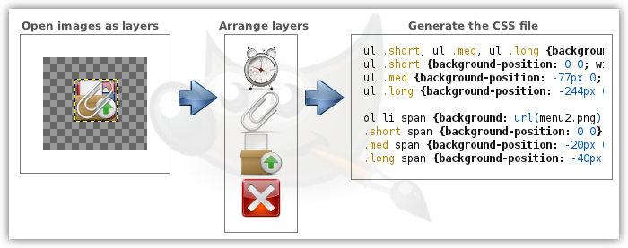

[in english](README.md)

Gimp Websprites
====
Scripts para ajudá-lo a criar sprites CSS e reduzir o número de requisições HTTP na sua página de Internet.

###1. Características###
Pacote de scripts-fu composto por 3 scripts, onde temos:
* Exportação de arquivo CSS para usar a web sprite;
* Organização de layers horizontalmente, lado a lado;
* Organização de layers verticalmente, um sobre o outro.

###2. Menu###
Os menus de acesso aos três scripts são os seguintes:
* Image/Web Sprites/Organizar layers horizontalmente
* Image/Web Sprites/Organizar layers verticalmente
* Image/Web Sprites/Exportar arquivo CSS

###3. Script de ordenação###
Estes scripts irão simplesmente reposicionar horizontalmente, ou verticalmente, cada camada e em seguida irá redimensionar o canvas para caber as camadas.  
Sempre que possível, prefira usar ordenação horizontal porque irá resultar em arquivos de imagem menores.

###4. Script de exportação###

######4.1. Seletores CSS######
Os seletores CSS resultantes da exportação serão nomeados de acordo com as camadas da imagem. Isso significa que se você tem uma camada que deseja exportar como "div.icon", você deve colocar este mesmo nome na camada.

######4.2 Opções######
Ao acionar o script, abrirá uma caixa de diálogo com as opções de geração do arquivo. As opções são as seguintes:

Option | Description |
-------|-------------|
Arquivo CSS (arquivo a salvar) | Entre aqui com o nome do arquivo CSS a gerar.
Diretório do arquivo CSS | Diretório onde salvar o arquivo.
Arquivo de imagem (bkg-image) | Nome da imagem/sprite que será usada no CSS (ex.: a própria imagem exportada para PNG).
Prefixo dos seletores | Prefixo a incluir em cada seletor CSS. Ex.: Você está montando um menu onde cada item é um "li" e está identificado por uma classe, utilize "li.". Assim um layer chamado "home" irá resultar no seletor "li.home".
Sufixo dos seletores | Sufixo a incluir em cada seletor CSS. Ex.: Seguindo o exemplo acima, defina como " > span" para resultar em "li.home > span".
Repetição do Background | Regra "background-repeat" a incluir. Caso queira deixar em branco selecione "Leave it Blank!".
Seletor de abstração | Seletor de abstração para definir reduzir a redundância no CSS. Ex.: Está montando um menu onde cada item é um "LI" então defina como "li ". Assim propriedades como "background-image" será definido somente nesta abstração e não nos seletores de cada layer.
Agrupar seletores | Marque para agrupar os seletores em uma única regra CSS e definir coisas tipo "background-image" e reduzir então a redundância do CSS. Use isto quando não for possível usar o seletor de abstração.
Incluir largura do layer |Incluir a largura de cada layer no CSS.
Incluir altura do layer | Incluir a altura de cada layer no CSS.
Definir tamanho no grupo/abstração | Use isto para que largura e altura sejam definidas somente no agrupamento de seletores e/ou no seletor de abstração. Neste caso, serão utilizadas as medidas do primeiro layer encontrado.
Manter espaços em branco | Desmarque isto para remover todos espaços em branco não obrigatórios.
Manter quebras de linha | Desmarque isto para remove todas as quebras de linha não obrigatórias (todas).
Remover extensão de arquivo | Desmarque isto caso não queira que a extensão dos arquivos presente no nome dos layers não seja removida. Lembrando que pontos no CSS tem uma utilidade específica e não pode fazer parte do identificador de um seletor.
